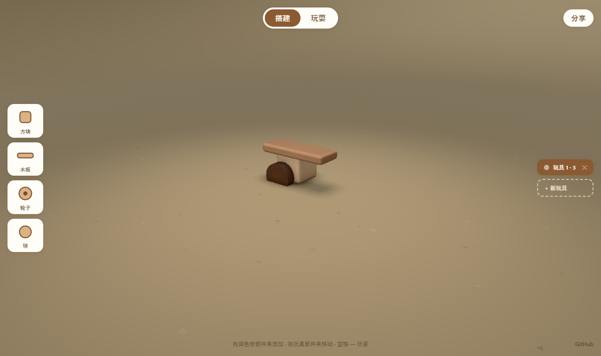

<div align="center">

# 🧸 玩具工坊 · Toys

> *「拼几块木头，让它转起来，然后按下空格——看它自己活过来。」*




**一个浏览器里的木质积木玩具工坊：把木块拼在一起、给零件设个转轴，切到「玩耍」模式，你的玩具就掉到地上、马达启动、真实物理让它自己动起来——还能录 5 秒短片、把整个玩具编码进链接分享出去。**

<sub>不是看别人的 demo —— 是你亲手拼、亲手让它活过来的小工坊。</sub>

### ▶ [在线体验 · Live Demo](https://shushuitie2017.github.io/toys/)

[看效果](#-效果示例) · [在线体验](#-在线体验) · [玩法](#-玩法) · [技术栈](#-技术栈) · [诚实边界](#-诚实边界) · [English](#english)

</div>

---

## 🔥 效果示例

左边调色板拖出**方块 / 木板 / 轮子 / 球**，在地板上拼成一个玩具；点中某个零件——拖橙色手柄缩放、按 `S` 让它旋转、拖圆点挪转轴、`D` 对称复制。然后按 **空格** 切到玩耍模式：

<div align="center">

</div>

> **它的乐趣不在“看一个 3D 演示”，而在“无中生有”——四种木头零件、一个转轴、一次真实物理模拟，就能让一堆积木变成会动的小车、会摇的跷跷板、会转的风车。**

## ▶ 在线体验

**[👉 shushuitie2017.github.io/toys](https://shushuitie2017.github.io/toys/)** —— 打开即玩，无需安装。

本地跑一份也极简（**纯静态站，无需构建**，依赖走 CDN）：

```bash
# 任意静态服务器起在项目目录即可
python -m http.server 5031        # 然后打开 http://127.0.0.1:5031/
# 或 pnpm dlx serve
```

> ⚠️ 需要**支持 WebGPU 的浏览器**（Chrome / Edge 113+）。它用的是 Three.js 的 `WebGPURenderer`，没有 WebGL 回退。

## 🎮 玩法

- **搭建** —— 从调色板把零件拖到地板或已有玩具上。点中零件后：拖**橙色手柄**缩放、`S` 让它旋转、拖**圆点**移动转轴、`D` 对称复制到另一侧、`delete` 删除。拖零件可重新拼接，拖底座可整体移动。
- **玩耍**（`空格`）—— 玩具掉到地上、马达启动。点一个玩具聚焦相机，`R` 重置。玩具列表里的**眼睛**图标选谁上场。
- **分享** —— 录一段 5 秒短片，并复制一条把玩具编码进 URL 的链接。搭建过程也会实时存进 localStorage。

## 🛠️ 技术栈

| | |
|---|---|
| **Three.js** | `WebGPURenderer` + TSL 木纹材质 + GTAO 环境光遮蔽 |
| **box3d.js** | 真实刚体物理（掉落、碰撞、马达驱动） |
| **WebCodecs + MP4 muxer** | 浏览器内录制导出视频 |

无游戏引擎、无打包、无资产管线——一个 `index.html` + 一份 `main.js`，依赖走 CDN importmap。

## 🙏 诚实边界

- **这是开源项目的中文改编版**：UI 全面中文化；深层代码注释与 `console` 调试信息仍为英文（面向开发者）。
- **只在 WebGPU 浏览器里能跑**：Chrome / Edge 113+ 等；不支持 WebGPU 的浏览器打不开，没有 WebGL 回退。
- **依赖走 CDN**：three.js 用的是 `@dev` 前沿构建，功能新但偶有波动；离线环境需自行改成本地依赖。
- **移动端体验有限**：核心是桌面拖拽交互，手机上可玩但不是最佳。

## 👤 关于作者

**蓝猫 · BlueCat** —— AI-native builder，做能上线的中英日三语产品。

| | |
|---|---|
| 🌐 站点矩阵 | [bluecatbot.com](https://bluecatbot.com) |
| 🐙 GitHub | [@shushuitie2017](https://github.com/shushuitie2017) |

<div align="center">
<br>
<sub>👆 微信扫码，聊 Three.js / WebGPU / 创意编程</sub>
</div>

### 也在做

- 🕷️ **[蓝猫蜘蛛](https://shushuitie2017.github.io/bluecat-spider/)** —— 纯数学驱动的自稳定程序化 IK 蜘蛛，能爬任意地形
- 🎮 **[Three.js Skills](https://github.com/shushuitie2017/threejs-skills)** —— 把 9 个 Three.js 游戏开发技能装进 AI Agent
- 🧊 **[蓝猫 3D](https://3d.bluecatbot.com)** —— AI × 3D 角色产线的工具榜单 + 九步实战课

## 📄 许可证

**MIT —— 随便用，随便改，随便造。**

---

## English

**玩具工坊 · Toys (BlueCat edition)** is a Chinese adaptation of a little in-browser toy maker: snap wooden pieces together, give parts a spin axis, then hit `space` and watch your toys drop, their motors start, and real physics bring them to life — record a 5-second clip and share a link with the whole toy encoded in the URL.

**[▶ Play it live](https://shushuitie2017.github.io/toys/)** · Pure static site, no build (CDN importmap). Requires a **WebGPU browser** (Chrome / Edge 113+). Built with Three.js `WebGPURenderer` (TSL wood + GTAO) and box3d.js physics. MIT licensed.

---

<div align="center">

*拼几块木头，让它转起来，然后按下空格——看它自己活过来。*

**[🧸 在线体验 · shushuitie2017.github.io/toys](https://shushuitie2017.github.io/toys/)**

</div>
